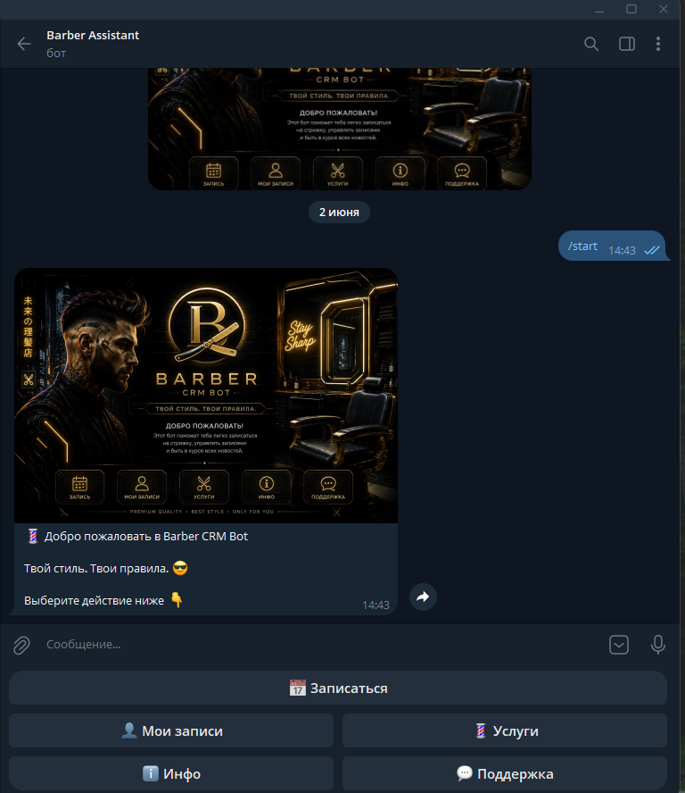
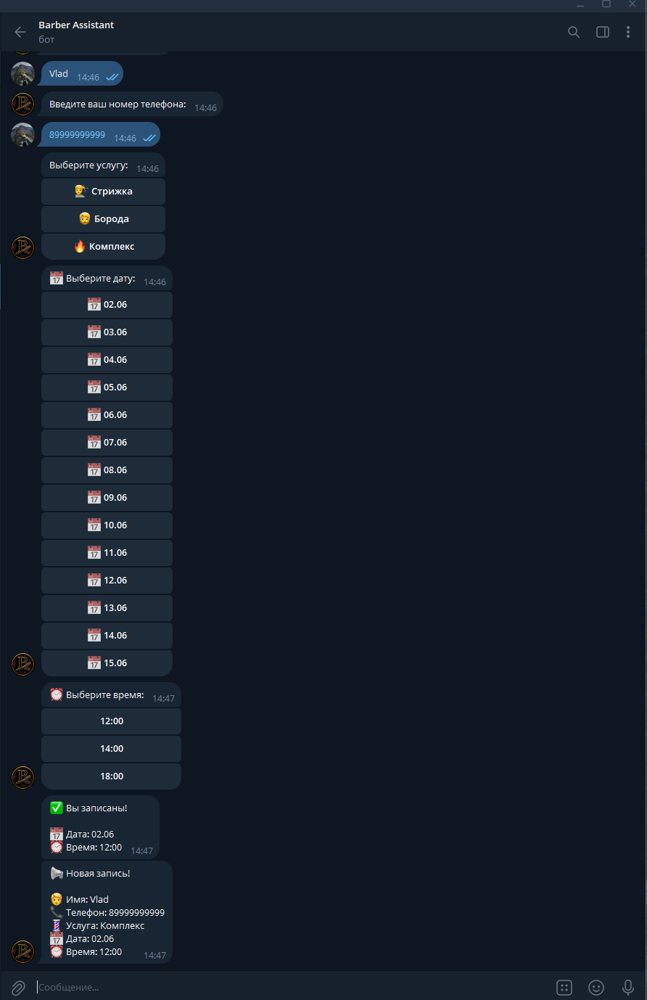
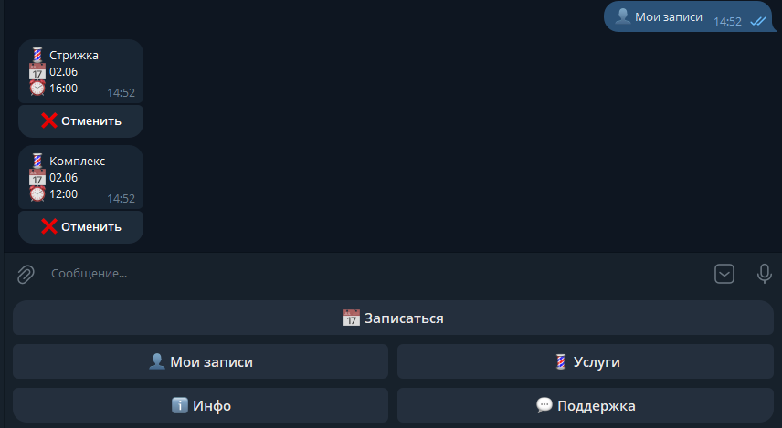
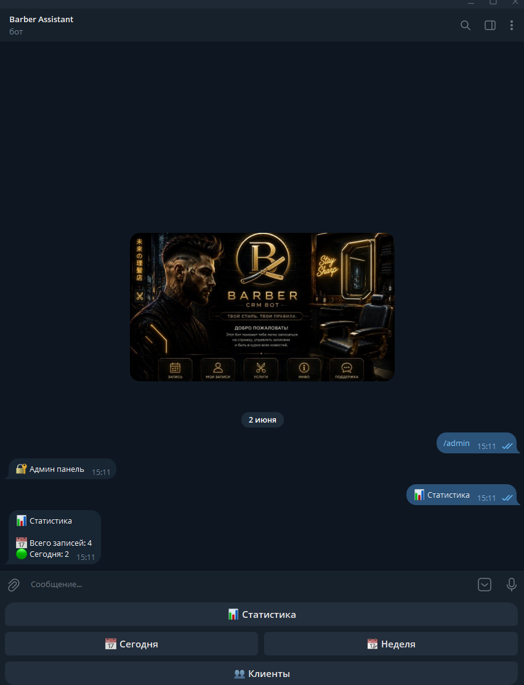

# 💈 Telegram Barbershop CRM Bot

Production-ready Telegram CRM bot for barbershops and service businesses.

## Features

* 📅 Online booking
* 👤 Personal cabinet
* ❌ Booking cancellation
* 💈 Service selection
* 📆 Dynamic 14-day calendar
* ⏰ Automatic slot availability
* 📊 Admin statistics
* 📋 Client management
* ☁️ Railway deployment
* 🐘 PostgreSQL database

## Admin Commands

* `/clients` — list of clients
* `/today` — today's bookings
* `/week` — upcoming bookings
* `/stats` — booking statistics

## Tech Stack

* Python 3
* Aiogram 3
* PostgreSQL
* Railway
* GitHub

## Architecture

* FSM (Finite State Machine)
* PostgreSQL persistence
* Inline keyboards
* Modular handlers
* Environment variables

## Deployment

The bot is deployed on Railway and uses PostgreSQL for data storage.

## Docker

Build image:

```bash
docker build -t barbershop-bot .
```

Run container:

```bash
docker run -d --name barbershop-bot \
-e BOT_TOKEN=your_token \
-e ADMIN_ID=your_admin_id \
-e DATABASE_URL=your_database_url \
barbershop-bot
```

## Environment Variables

Required environment variables:

| Variable     | Description                  |
| ------------ | ---------------------------- |
| BOT_TOKEN    | Telegram bot token           |
| ADMIN_ID     | Telegram administrator ID    |
| DATABASE_URL | PostgreSQL connection string |


## Screenshots

### Main Menu



### Booking Process



### Personal Cabinet



### Admin Panel


